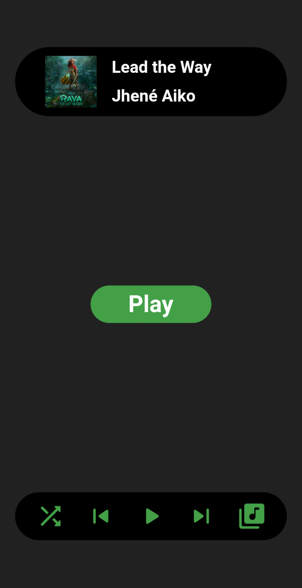
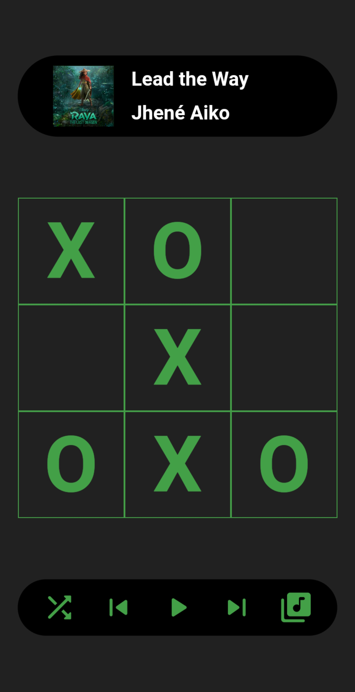
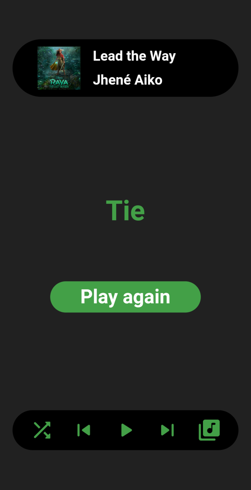
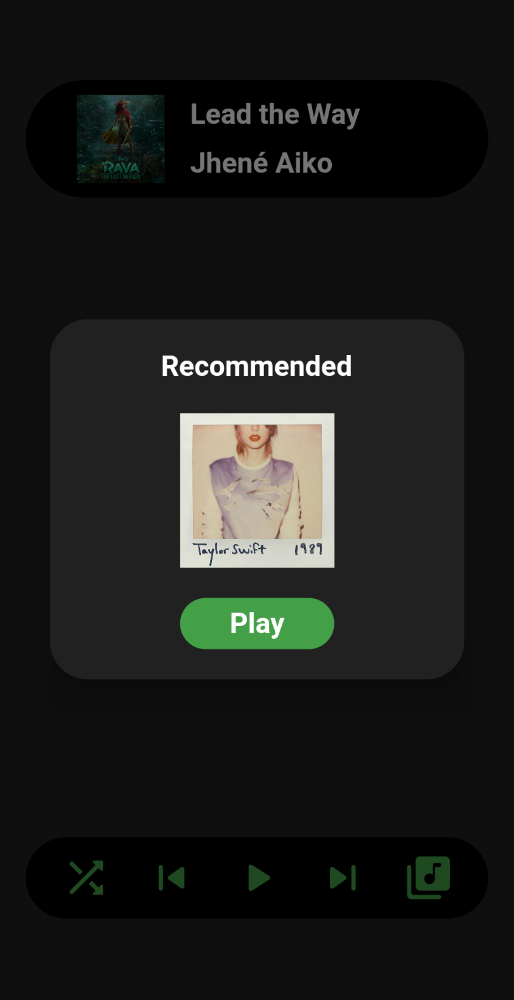

# Spotify-Tic-Tac-Toe
A basic Tic-Tac-Toe game in flutter along with Spotify integration.

# Screenshots
      

# How to run this project in your local environment

>Note : Only works on android with spotify installed

- Create a spotify developer account
- Generate a sha-1 fingerprint
- Add the sha-1 fingerprint and package name to spotify dashboard
- Add client ID and redirect URL to **app/lib/logic/spotifyBloc.dart**
